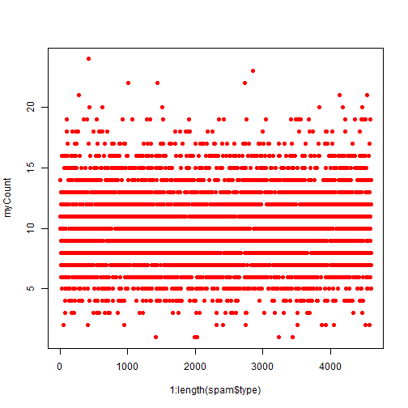
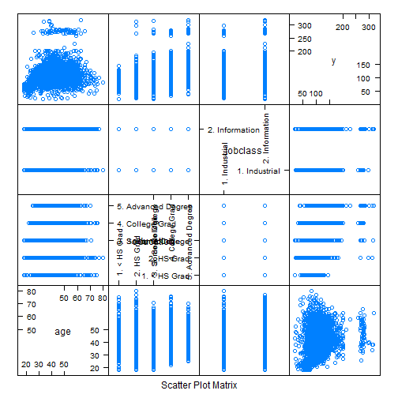
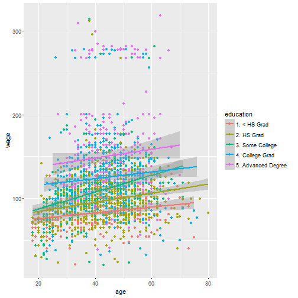
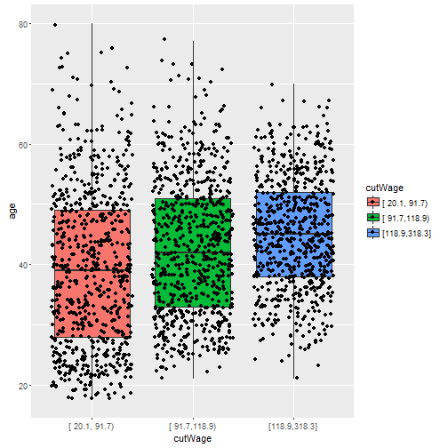
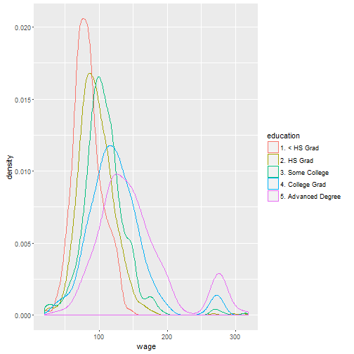

## Overall Objective  

This R Markdown is to document some key ideas I have seen about the "caret" library in a JHU Coursera module on Practical Machine Learning.  The basic syntax of caret ports across many different analysis techniques, and it seems extremely handy for many phases of analysis.  
  
The broad themes of care include:  
  
* Pre-processing data - preProcess()  
* Partitioning raw data in to test/train - createDataPartition(), createResample(), createTimeSlices()  
* Training models on the training data - train()  
* Applying a training model to an analogous dataset - predict()  
* Comparing predictions (often to reality) - confusionMatrix()  
  
## Caret Usage  
####_Basic Example_  
Below is a basic example for using caret to make and test a simple prediction.  The "spam" dataset from library "kernlab" is assessed through this simple example.  

First, the relevant libraries are loaded, with a data partition index creates and then applied to create testing and training data.  Note that -inTrain means exclude the indices contained by inTrain, so testing and training will be mutually exclusive in this case.  


```r
library(caret); 
library(kernlab); 
```

```
## 
## Attaching package: 'kernlab'
```

```
## The following object is masked from 'package:ggplot2':
## 
##     alpha
```

```r
data(spam, package="kernlab") ## make sure to get the kernlab version rather than ElemStatLearn

## Use createDataPartition() to create an index with 75% of the row numbers
inTrain <- createDataPartition(y=spam$type, p=0.75, list=FALSE)
training <- spam[inTrain, ]
testing <- spam[-inTrain, ]
dim(training)
```

```
## [1] 3451   58
```

Next, we use caret to run GLM on the training data.  The training syntax almost always looks just like this, although with changes to the ~ formula and/or method statement.  Depending on the method (e.g., bootstrap or resample), there is sometimes an RNG component and thus merit to setting the seed.  Note that caret and all of its sub-components are frequently being updated (sometimes with impact on RNG), so there is no real guarantee of reproducibility once any component(s) of the version originally used has been sunsetted.  


```r
set.seed(32343)

## Runs the GLM and stores the outputs as modelFit
modelFit <- train(type ~ ., data=training, method="glm")
```

```
## Warning: glm.fit: fitted probabilities numerically 0 or 1 occurred

## Warning: glm.fit: fitted probabilities numerically 0 or 1 occurred

## Warning: glm.fit: fitted probabilities numerically 0 or 1 occurred

## Warning: glm.fit: fitted probabilities numerically 0 or 1 occurred

## Warning: glm.fit: fitted probabilities numerically 0 or 1 occurred

## Warning: glm.fit: fitted probabilities numerically 0 or 1 occurred

## Warning: glm.fit: fitted probabilities numerically 0 or 1 occurred

## Warning: glm.fit: fitted probabilities numerically 0 or 1 occurred

## Warning: glm.fit: fitted probabilities numerically 0 or 1 occurred

## Warning: glm.fit: fitted probabilities numerically 0 or 1 occurred

## Warning: glm.fit: fitted probabilities numerically 0 or 1 occurred

## Warning: glm.fit: fitted probabilities numerically 0 or 1 occurred

## Warning: glm.fit: fitted probabilities numerically 0 or 1 occurred

## Warning: glm.fit: fitted probabilities numerically 0 or 1 occurred

## Warning: glm.fit: fitted probabilities numerically 0 or 1 occurred

## Warning: glm.fit: fitted probabilities numerically 0 or 1 occurred

## Warning: glm.fit: fitted probabilities numerically 0 or 1 occurred

## Warning: glm.fit: fitted probabilities numerically 0 or 1 occurred

## Warning: glm.fit: fitted probabilities numerically 0 or 1 occurred

## Warning: glm.fit: fitted probabilities numerically 0 or 1 occurred

## Warning: glm.fit: fitted probabilities numerically 0 or 1 occurred

## Warning: glm.fit: fitted probabilities numerically 0 or 1 occurred
```

```
## Warning: glm.fit: algorithm did not converge
```

```
## Warning: glm.fit: fitted probabilities numerically 0 or 1 occurred

## Warning: glm.fit: fitted probabilities numerically 0 or 1 occurred

## Warning: glm.fit: fitted probabilities numerically 0 or 1 occurred

## Warning: glm.fit: fitted probabilities numerically 0 or 1 occurred
```

```r
## Prints descriptors of modelFit
modelFit
```

```
## Generalized Linear Model 
## 
## 3451 samples
##   57 predictor
##    2 classes: 'nonspam', 'spam' 
## 
## No pre-processing
## Resampling: Bootstrapped (25 reps) 
## Summary of sample sizes: 3451, 3451, 3451, 3451, 3451, 3451, ... 
## Resampling results
## 
##   Accuracy   Kappa      Accuracy SD  Kappa SD 
##   0.9191664  0.8300333  0.009175581  0.0185186
## 
## 
```

```r
## Prints coefficients that come back from the final GLM selected
modelFit$finalModel
```

```
## 
## Call:  NULL
## 
## Coefficients:
##       (Intercept)               make            address  
##        -1.585e+00         -3.803e-01         -1.482e-01  
##               all              num3d                our  
##         1.412e-01          2.708e+00          6.933e-01  
##              over             remove           internet  
##         8.351e-01          1.969e+00          6.186e-01  
##             order               mail            receive  
##         5.398e-01          4.598e-02          1.835e-02  
##              will             people             report  
##        -1.705e-01         -2.102e-01          2.545e-01  
##         addresses               free           business  
##         1.558e+00          9.797e-01          9.915e-01  
##             email                you             credit  
##         2.802e-01          1.003e-01          7.758e-01  
##              your               font             num000  
##         2.123e-01          1.973e-01          3.191e+00  
##             money                 hp                hpl  
##         1.916e+00         -2.091e+00         -1.120e+00  
##            george             num650                lab  
##        -1.002e+01          4.907e-01         -1.980e+00  
##              labs             telnet             num857  
##        -2.370e-01          1.560e+00          6.154e-01  
##              data             num415              num85  
##        -1.182e+00         -9.935e+00         -3.889e+00  
##        technology            num1999              parts  
##         1.279e+00          5.989e-02         -5.860e-01  
##                pm             direct                 cs  
##        -8.428e-01         -4.588e-01         -4.460e+01  
##           meeting           original            project  
##        -2.509e+00         -1.168e+00         -1.241e+00  
##                re                edu              table  
##        -7.946e-01         -1.184e+00         -2.905e+00  
##        conference      charSemicolon   charRoundbracket  
##        -4.284e+00         -1.448e+00         -1.651e-01  
## charSquarebracket    charExclamation         charDollar  
##        -7.570e-01          2.526e-01          3.892e+00  
##          charHash         capitalAve        capitalLong  
##         3.128e+00          1.138e-02          7.075e-03  
##      capitalTotal  
##         9.504e-04  
## 
## Degrees of Freedom: 3450 Total (i.e. Null);  3393 Residual
## Null Deviance:	    4628 
## Residual Deviance: 1356 	AIC: 1472
```

```r
## Applies modelFit (which was built from training) to make predictions on the testing data
predictions <- predict(modelFit, newdata=testing)

## Runs the confusion matrix and outputs some interesting statistics
confusionMatrix(predictions, testing$type)
```

```
## Confusion Matrix and Statistics
## 
##           Reference
## Prediction nonspam spam
##    nonspam     658   53
##    spam         39  400
##                                          
##                Accuracy : 0.92           
##                  95% CI : (0.9028, 0.935)
##     No Information Rate : 0.6061         
##     P-Value [Acc > NIR] : <2e-16         
##                                          
##                   Kappa : 0.8315         
##  Mcnemar's Test P-Value : 0.1753         
##                                          
##             Sensitivity : 0.9440         
##             Specificity : 0.8830         
##          Pos Pred Value : 0.9255         
##          Neg Pred Value : 0.9112         
##              Prevalence : 0.6061         
##          Detection Rate : 0.5722         
##    Detection Prevalence : 0.6183         
##       Balanced Accuracy : 0.9135         
##                                          
##        'Positive' Class : nonspam        
## 
```
  
There are frequently warnings thrown back by the caret library, though they often do not seem to impact the predictive ability.  The library is sometimes a bit of a black-box, and prediction is an area that often contains extreme trade-offs between parsimony, intepretability, scalability, predictive power, and the like.  It is wise to be sure the approach and final model align reasonably with how the specific end-user for the algorithm might prioritize these aims.  
  
####_Data Slicing_  
Continuing with the spam dataset, we may want to slice it.  There are three common methods described below:  
  
* k-fold  
* resample  
* time slices  
  

```r
## ?createFolds will bring up the help menu for all types of data splitting

## Document the length of the spam dataset
length(spam$type)
```

```
## [1] 4601
```

```r
## Create 10 folds (all independent)
set.seed(32323)
folds <- createFolds(y=spam$type, k=10, list=TRUE, returnTrain=FALSE)
sapply(folds, FUN=length)
```

```
## Fold01 Fold02 Fold03 Fold04 Fold05 Fold06 Fold07 Fold08 Fold09 Fold10 
##    460    461    460    459    461    459    460    460    461    460
```

```r
sum(sapply(folds, FUN=length)) ## same length as original
```

```
## [1] 4601
```

```r
myCheck <- NULL
for (intCtr in 1:10) { myCheck <- c(myCheck, folds[[intCtr]]) }
identical(1:length(spam$type), myCheck[order(myCheck)]) ## all elements used exactly once
```

```
## [1] TRUE
```

```r
folds[[1]][1:10]
```

```
##  [1] 24 27 32 40 41 43 55 58 63 68
```

```r
## Create 10 resamples (data can be used multiple times)
set.seed(32323)
folds <- createResample(y=spam$type, times=10, list=TRUE)
sapply(folds, length) ## Each fold same length as original
```

```
## Resample01 Resample02 Resample03 Resample04 Resample05 Resample06 
##       4601       4601       4601       4601       4601       4601 
## Resample07 Resample08 Resample09 Resample10 
##       4601       4601       4601       4601
```

```r
myCheck <- NULL
for (intCtr in 1:10) { myCheck <- c(myCheck, folds[[intCtr]]) }
myCount <- NULL
for (intCtr in 1:length(spam$type)) { myCount <- c(myCount, sum(myCheck==intCtr)) }
plot(x=1:length(spam$type), y=myCount, col="red", pch=19) ## Indices used different # times
```



```r
## Create test/train data for a time series (needs to be reasonably contiguous)
set.seed(32323)
tme <- 1:1000 ## For my series, I am interested in times 1-1000
folds <- createTimeSlices(y=tme, initialWindow=20, horizon=10) ## train on 20, test on 10
names(folds)
```

```
## [1] "train" "test"
```

```r
folds$train[[1]] ## First fold trains on 1-20
```

```
##  [1]  1  2  3  4  5  6  7  8  9 10 11 12 13 14 15 16 17 18 19 20
```

```r
folds$test[[1]] ## First fold tests on 21-30
```

```
##  [1] 21 22 23 24 25 26 27 28 29 30
```

```r
folds$train[[length(folds$train)]] ## Last fold trains on 971-990 (max is 1000 per tme)
```

```
##  [1] 971 972 973 974 975 976 977 978 979 980 981 982 983 984 985 986 987
## [18] 988 989 990
```

```r
folds$test[[length(folds$train)]] ## Last fold tests on 991-1000 (max is 1000 per tme)
```

```
##  [1]  991  992  993  994  995  996  997  998  999 1000
```

Some of the algorithms in the caret library take care of these automatically.  However, it is nice to have the flexibility to create partitions in whatever manner is best suited for the task at hand.  
  
####_Training options_  
There are many options that can be used while training the data.  Typically, it is fine to just use the defaults, but some of the options include:  

```r
args(train.default)
```

```
## function (x, y, method = "rf", preProcess = NULL, ..., weights = NULL, 
##     metric = ifelse(is.factor(y), "Accuracy", "RMSE"), maximize = ifelse(metric %in% 
##         c("RMSE", "logLoss"), FALSE, TRUE), trControl = trainControl(), 
##     tuneGrid = NULL, tuneLength = 3) 
## NULL
```

```r
## metric can be RMSE/RSquared for continuous and Accuracy/Kappa for categorical
## weights would be if you have (for example) and unbalanced training set

args(trainControl)
```

```
## function (method = "boot", number = ifelse(grepl("cv", method), 
##     10, 25), repeats = ifelse(grepl("cv", method), 1, number), 
##     p = 0.75, search = "grid", initialWindow = NULL, horizon = 1, 
##     fixedWindow = TRUE, verboseIter = FALSE, returnData = TRUE, 
##     returnResamp = "final", savePredictions = FALSE, classProbs = FALSE, 
##     summaryFunction = defaultSummary, selectionFunction = "best", 
##     preProcOptions = list(thresh = 0.95, ICAcomp = 3, k = 5), 
##     sampling = NULL, index = NULL, indexOut = NULL, timingSamps = 0, 
##     predictionBounds = rep(FALSE, 2), seeds = NA, adaptive = list(min = 5, 
##         alpha = 0.05, method = "gls", complete = TRUE), trim = FALSE, 
##     allowParallel = TRUE) 
## NULL
```
  
Some of the key options for trainControl can include:  
  
* method= (boot, boot632, cv, repeatedcv, LOOCV) for (boostrap, bootstrap with adjustment, cross-validate, repeatedly cross-validate, leave-one-out-cross-validation)  
* number= (for boot/cross-validation, number of samples to take)  
* repeats= (number of times to repeat sub-sampling; if big, this can slow things down)  
  
It is generally valuable to set a seed, either overall or for each resample (especially for parallel fits).  
  
####_Plotting predictors_  
Plotting the predictors can be a helpful component of exploratory data analysis prior to running prediction algorithms.  This example will focus on the "Wage" data from the ISLR library.  
  

```r
library(ISLR); library(ggplot2); library(caret)
data(Wage)
summary(Wage)
```

```
##       year           age               sex                    maritl    
##  Min.   :2003   Min.   :18.00   1. Male  :3000   1. Never Married: 648  
##  1st Qu.:2004   1st Qu.:33.75   2. Female:   0   2. Married      :2074  
##  Median :2006   Median :42.00                    3. Widowed      :  19  
##  Mean   :2006   Mean   :42.41                    4. Divorced     : 204  
##  3rd Qu.:2008   3rd Qu.:51.00                    5. Separated    :  55  
##  Max.   :2009   Max.   :80.00                                           
##                                                                         
##        race                   education                     region    
##  1. White:2480   1. < HS Grad      :268   2. Middle Atlantic   :3000  
##  2. Black: 293   2. HS Grad        :971   1. New England       :   0  
##  3. Asian: 190   3. Some College   :650   3. East North Central:   0  
##  4. Other:  37   4. College Grad   :685   4. West North Central:   0  
##                  5. Advanced Degree:426   5. South Atlantic    :   0  
##                                           6. East South Central:   0  
##                                           (Other)              :   0  
##            jobclass               health      health_ins      logwage     
##  1. Industrial :1544   1. <=Good     : 858   1. Yes:2083   Min.   :3.000  
##  2. Information:1456   2. >=Very Good:2142   2. No : 917   1st Qu.:4.447  
##                                                            Median :4.653  
##                                                            Mean   :4.654  
##                                                            3rd Qu.:4.857  
##                                                            Max.   :5.763  
##                                                                           
##       wage       
##  Min.   : 20.09  
##  1st Qu.: 85.38  
##  Median :104.92  
##  Mean   :111.70  
##  3rd Qu.:128.68  
##  Max.   :318.34  
## 
```

```r
inTrain <- createDataPartition(y=Wage$wage, p=0.7, list=FALSE)
training <- Wage[inTrain, ]
testing <- Wage[-inTrain, ]
dim(training); dim(testing)
```

```
## [1] 2102   12
```

```
## [1] 898  12
```

One option is to create a feature plot for a few key variables.  

```r
featurePlot(x=training[ , c("age", "education", "jobclass")], y=training$wage, plot="pairs")
```


  
Another option is to use ggplot2 for color and regression smoothning.  

```r
## Color by jobclass
qplot(age, wage, data=training, color=jobclass)
```


```r
## Color by education and add a regression smooth
qq <- qplot(age, wage, data=training, color=education)
qq + geom_smooth(method="lm", formula=y~x)
```



Another option is to create factors and then use jitter to make the boxplot.  

```r
library(Hmisc)
cutWage <- cut2(training$wage, g=3)
table(cutWage)
```

```
## cutWage
## [ 20.1, 91.7) [ 91.7,118.9) [118.9,318.3] 
##           703           721           678
```

```r
p2 <- qplot(cutWage, age, data=training, fill=cutWage, geom=c("boxplot", "jitter"))
p2
```



```r
t1 <- table(cutWage, training$jobclass)
t1
```

```
##                
## cutWage         1. Industrial 2. Information
##   [ 20.1, 91.7)           437            266
##   [ 91.7,118.9)           373            348
##   [118.9,318.3]           274            404
```

```r
prop.table(t1, 1)
```

```
##                
## cutWage         1. Industrial 2. Information
##   [ 20.1, 91.7)     0.6216216      0.3783784
##   [ 91.7,118.9)     0.5173370      0.4826630
##   [118.9,318.3]     0.4041298      0.5958702
```
  
And yet another option is to look at the density plots.  

```r
qplot(wage, color=education, data=training, geom="density")
```



Some additional notes relevant to the prediction process include:  
  
1.  Only use the training data for plotting - no cheating with a peek at the test data!  
2.  Look for imbalances in outcomes/predictors, outliers, groups of "unexplained" points, skewed variables, etc.  
3.  Try to find the ggplot2 tutorial and the caret tutorial  
  
####_Pre-processing_  
