## Overall Objective  
This R Markdown is to document some key ideas I have seen about the "caret" library in a JHU Coursera module on Practical Machine Learning.  The basic syntax of caret ports across many different analysis techniques, and it seems extremely handy for many phases of analysis.  The document primarily captures the code used in the JHU module for my personal future reference, along with a mix of instructor thoughts and a few of my syntheses.
  
The broad themes of caret include:  
  
* Pre-processing data - preProcess()  
* Partitioning raw data in to test/train - createDataPartition(), createResample(), createTimeSlices()  
* Training models on the training data - train()  
* Applying a training model to an analogous dataset - predict()  
* Comparing predictions (often to reality) - confusionMatrix()  
  
## Caret Usage  
####_Basic Example_  
Below is a basic example for using caret to make and test a simple prediction.  The "spam" dataset from library "kernlab" is assessed through this simple example.  

First, the relevant libraries are loaded, with a data partition index creates and then applied to create testing and training data.  Note that -inTrain means exclude the indices contained by inTrain, so testing and training will be mutually exclusive in this case.  


```r
library(caret); 
```

```
## Warning: package 'caret' was built under R version 3.2.4
```

```
## Loading required package: lattice
```

```
## Loading required package: ggplot2
```

```r
library(kernlab); 
```

```
## 
## Attaching package: 'kernlab'
```

```
## The following object is masked from 'package:ggplot2':
## 
##     alpha
```

```r
data(spam, package="kernlab") ## make sure to get the kernlab version rather than ElemStatLearn

## Use createDataPartition() to create an index with 75% of the row numbers
inTrain <- createDataPartition(y=spam$type, p=0.75, list=FALSE)
training <- spam[inTrain, ]
testing <- spam[-inTrain, ]
dim(training)
```

```
## [1] 3451   58
```

Next, we use caret to run GLM on the training data.  The training syntax almost always looks just like this, although with changes to the ~ formula and/or method statement.  Depending on the method (e.g., bootstrap or resample), there is sometimes an RNG component and thus merit to setting the seed.  Note that caret and all of its sub-components are frequently being updated (sometimes with impact on RNG), so there is no real guarantee of reproducibility once any component(s) of the version originally used has been sunsetted.  


```r
set.seed(32343)

## Runs the GLM and stores the outputs as modelFit
modelFit <- train(type ~ ., data=training, method="glm")
```

```
## Warning: glm.fit: fitted probabilities numerically 0 or 1 occurred

## Warning: glm.fit: fitted probabilities numerically 0 or 1 occurred

## Warning: glm.fit: fitted probabilities numerically 0 or 1 occurred

## Warning: glm.fit: fitted probabilities numerically 0 or 1 occurred

## Warning: glm.fit: fitted probabilities numerically 0 or 1 occurred

## Warning: glm.fit: fitted probabilities numerically 0 or 1 occurred

## Warning: glm.fit: fitted probabilities numerically 0 or 1 occurred

## Warning: glm.fit: fitted probabilities numerically 0 or 1 occurred

## Warning: glm.fit: fitted probabilities numerically 0 or 1 occurred

## Warning: glm.fit: fitted probabilities numerically 0 or 1 occurred

## Warning: glm.fit: fitted probabilities numerically 0 or 1 occurred

## Warning: glm.fit: fitted probabilities numerically 0 or 1 occurred

## Warning: glm.fit: fitted probabilities numerically 0 or 1 occurred

## Warning: glm.fit: fitted probabilities numerically 0 or 1 occurred

## Warning: glm.fit: fitted probabilities numerically 0 or 1 occurred

## Warning: glm.fit: fitted probabilities numerically 0 or 1 occurred

## Warning: glm.fit: fitted probabilities numerically 0 or 1 occurred

## Warning: glm.fit: fitted probabilities numerically 0 or 1 occurred

## Warning: glm.fit: fitted probabilities numerically 0 or 1 occurred

## Warning: glm.fit: fitted probabilities numerically 0 or 1 occurred

## Warning: glm.fit: fitted probabilities numerically 0 or 1 occurred

## Warning: glm.fit: fitted probabilities numerically 0 or 1 occurred

## Warning: glm.fit: fitted probabilities numerically 0 or 1 occurred

## Warning: glm.fit: fitted probabilities numerically 0 or 1 occurred

## Warning: glm.fit: fitted probabilities numerically 0 or 1 occurred

## Warning: glm.fit: fitted probabilities numerically 0 or 1 occurred
```

```r
## Prints descriptors of modelFit
modelFit
```

```
## Generalized Linear Model 
## 
## 3451 samples
##   57 predictor
##    2 classes: 'nonspam', 'spam' 
## 
## No pre-processing
## Resampling: Bootstrapped (25 reps) 
## Summary of sample sizes: 3451, 3451, 3451, 3451, 3451, 3451, ... 
## Resampling results
## 
##   Accuracy   Kappa      Accuracy SD  Kappa SD  
##   0.9183567  0.8279095  0.007309417  0.01494435
## 
## 
```

```r
## Prints coefficients that come back from the final GLM selected
modelFit$finalModel
```

```
## 
## Call:  NULL
## 
## Coefficients:
##       (Intercept)               make            address  
##        -1.715e+00         -1.907e-01         -1.348e-01  
##               all              num3d                our  
##         1.400e-01          2.086e+00          6.017e-01  
##              over             remove           internet  
##         6.921e-01          2.363e+00          6.442e-01  
##             order               mail            receive  
##         4.383e-01          1.264e-01         -5.628e-01  
##              will             people             report  
##        -1.427e-01         -1.643e-02          3.411e-01  
##         addresses               free           business  
##         1.354e+00          9.911e-01          8.592e-01  
##             email                you             credit  
##         8.997e-02          1.131e-01          8.973e-01  
##              your               font             num000  
##         2.142e-01          1.438e-01          2.588e+00  
##             money                 hp                hpl  
##         2.907e-01         -1.799e+00         -1.369e+00  
##            george             num650                lab  
##        -2.037e+01          4.838e-01         -2.175e+00  
##              labs             telnet             num857  
##        -1.459e-02          6.039e-01          2.021e+01  
##              data             num415              num85  
##        -1.369e+00         -1.899e+01         -1.929e+00  
##        technology            num1999              parts  
##         9.138e-01          5.989e-02          1.816e+00  
##                pm             direct                 cs  
##        -7.874e-01         -4.295e-01         -4.461e+01  
##           meeting           original            project  
##        -3.802e+00         -1.723e+00         -1.484e+00  
##                re                edu              table  
##        -8.548e-01         -1.222e+00         -1.674e+00  
##        conference      charSemicolon   charRoundbracket  
##        -4.443e+00         -1.236e+00          5.656e-02  
## charSquarebracket    charExclamation         charDollar  
##        -3.637e-01          2.345e-01          5.391e+00  
##          charHash         capitalAve        capitalLong  
##         2.504e+00          4.627e-02          1.068e-02  
##      capitalTotal  
##         9.979e-04  
## 
## Degrees of Freedom: 3450 Total (i.e. Null);  3393 Residual
## Null Deviance:	    4628 
## Residual Deviance: 1343 	AIC: 1459
```

```r
## Applies modelFit (which was built from training) to make predictions on the testing data
predictions <- predict(modelFit, newdata=testing)

## Runs the confusion matrix and outputs some interesting statistics
confusionMatrix(predictions, testing$type)
```

```
## Confusion Matrix and Statistics
## 
##           Reference
## Prediction nonspam spam
##    nonspam     660   57
##    spam         37  396
##                                           
##                Accuracy : 0.9183          
##                  95% CI : (0.9009, 0.9334)
##     No Information Rate : 0.6061          
##     P-Value [Acc > NIR] : < 2e-16         
##                                           
##                   Kappa : 0.8275          
##  Mcnemar's Test P-Value : 0.05003         
##                                           
##             Sensitivity : 0.9469          
##             Specificity : 0.8742          
##          Pos Pred Value : 0.9205          
##          Neg Pred Value : 0.9145          
##              Prevalence : 0.6061          
##          Detection Rate : 0.5739          
##    Detection Prevalence : 0.6235          
##       Balanced Accuracy : 0.9105          
##                                           
##        'Positive' Class : nonspam         
## 
```
  
There are frequently warnings thrown back by the caret library, though they often do not seem to impact the predictive ability.  The library is sometimes a bit of a black-box, and prediction is an area that often contains extreme trade-offs between parsimony, intepretability, scalability, predictive power, and the like.  It is wise to be sure the approach and final model align reasonably with how the specific end-user for the algorithm might prioritize these aims.  
  
####_Parallel Processing_  
Len Greski wrote an excellent article on using parallel processing for the train() function in caret.  This is particularly valuable for computationally intensive approaches as it increases R's ability to use my CPU from ~25% to ~75%.  See <https://github.com/lgreski/datasciencectacontent/blob/master/markdown/pml-randomForestPerformance.md>  

The below is cut/pasted from Len's blog so that I can easily access it even when I am offine.  As setup, Len uses the "sonar" data from the "mlbench" library.  See below:  

```r
library(mlbench)
```

```
## Warning: package 'mlbench' was built under R version 3.2.4
```

```r
data(Sonar)

inTraining <- createDataPartition(Sonar$Class, p = .75, list=FALSE)
training <- Sonar[inTraining,]
testing <- Sonar[-inTraining,]

# set up training run for x / y syntax because model format performs poorly
x <- training[,-61]
y <- training[,61]
```
  
Next, Len calls libraries for parallel processing and sets trainControl to allow for parallel processing.  

```r
library(parallel)
library(doParallel)
```

```
## Warning: package 'doParallel' was built under R version 3.2.4
```

```
## Loading required package: foreach
```

```
## Warning: package 'foreach' was built under R version 3.2.4
```

```
## foreach: simple, scalable parallel programming from Revolution Analytics
## Use Revolution R for scalability, fault tolerance and more.
## http://www.revolutionanalytics.com
```

```
## Loading required package: iterators
```

```r
cluster <- makeCluster(detectCores() - 1) # convention to leave 1 core for OS
registerDoParallel(cluster)

fitControl <- trainControl(method = "cv", number = 10, allowParallel = TRUE)
```
  
Then, Len runs train() function, calling fitControl to make sure it runs in parallel:  

```r
fit <- train(x, y, method="rf", data=Sonar, trControl = fitControl)
```

```
## Loading required package: randomForest
```

```
## Warning: package 'randomForest' was built under R version 3.2.4
```

```
## randomForest 4.6-12
```

```
## Type rfNews() to see new features/changes/bug fixes.
```

```
## 
## Attaching package: 'randomForest'
```

```
## The following object is masked from 'package:ggplot2':
## 
##     margin
```
  
Lastly, the cluster is explicitly shut down:  

```r
stopCluster(cluster)

## Seems to be needed, at least for my machine
registerDoSEQ() ## per http://stackoverflow.com/questions/25097729/un-register-a-doparallel-cluster
```
  
Len ran several experiments on a larger dataset and found that parallel processing on an HP Omen improved run time for a Random Forest called by train() from ~450 seconds to ~200 seconds.  This looks to be very handy.  
  

####_Data Slicing_  
Continuing with the spam dataset, we may want to slice it.  There are three common methods described below:  
  
* k-fold  
* resample  
* time slices  
  

```r
## ?createFolds will bring up the help menu for all types of data splitting

## Document the length of the spam dataset
length(spam$type)
```

```
## [1] 4601
```

```r
## Create 10 folds (all independent)
set.seed(32323)
folds <- createFolds(y=spam$type, k=10, list=TRUE, returnTrain=FALSE)
sapply(folds, FUN=length)
```

```
## Fold01 Fold02 Fold03 Fold04 Fold05 Fold06 Fold07 Fold08 Fold09 Fold10 
##    460    461    460    459    461    459    460    460    461    460
```

```r
sum(sapply(folds, FUN=length)) ## same length as original
```

```
## [1] 4601
```

```r
myCheck <- NULL
for (intCtr in 1:10) { myCheck <- c(myCheck, folds[[intCtr]]) }
identical(1:length(spam$type), myCheck[order(myCheck)]) ## all elements used exactly once
```

```
## [1] TRUE
```

```r
folds[[1]][1:10]
```

```
##  [1] 24 27 32 40 41 43 55 58 63 68
```

```r
## Create 10 resamples (data can be used multiple times)
set.seed(32323)
folds <- createResample(y=spam$type, times=10, list=TRUE)
sapply(folds, length) ## Each fold same length as original
```

```
## Resample01 Resample02 Resample03 Resample04 Resample05 Resample06 
##       4601       4601       4601       4601       4601       4601 
## Resample07 Resample08 Resample09 Resample10 
##       4601       4601       4601       4601
```

```r
myCheck <- NULL
for (intCtr in 1:10) { myCheck <- c(myCheck, folds[[intCtr]]) }
myCount <- NULL
for (intCtr in 1:length(spam$type)) { myCount <- c(myCount, sum(myCheck==intCtr)) }
plot(x=1:length(spam$type), y=myCount, col="red", pch=19) ## Indices used different # times
```

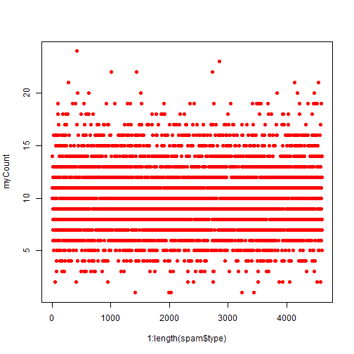

```r
## Create test/train data for a time series (needs to be reasonably contiguous)
set.seed(32323)
tme <- 1:1000 ## For my series, I am interested in times 1-1000
folds <- createTimeSlices(y=tme, initialWindow=20, horizon=10) ## train on 20, test on 10
names(folds)
```

```
## [1] "train" "test"
```

```r
folds$train[[1]] ## First fold trains on 1-20
```

```
##  [1]  1  2  3  4  5  6  7  8  9 10 11 12 13 14 15 16 17 18 19 20
```

```r
folds$test[[1]] ## First fold tests on 21-30
```

```
##  [1] 21 22 23 24 25 26 27 28 29 30
```

```r
folds$train[[length(folds$train)]] ## Last fold trains on 971-990 (max is 1000 per tme)
```

```
##  [1] 971 972 973 974 975 976 977 978 979 980 981 982 983 984 985 986 987
## [18] 988 989 990
```

```r
folds$test[[length(folds$train)]] ## Last fold tests on 991-1000 (max is 1000 per tme)
```

```
##  [1]  991  992  993  994  995  996  997  998  999 1000
```

Some of the algorithms in the caret library take care of these automatically.  However, it is nice to have the flexibility to create partitions in whatever manner is best suited for the task at hand.  
  
####_Training options_  
There are many options that can be used while training the data.  Typically, it is fine to just use the defaults, but some of the options include:  

```r
args(train.default)
```

```
## function (x, y, method = "rf", preProcess = NULL, ..., weights = NULL, 
##     metric = ifelse(is.factor(y), "Accuracy", "RMSE"), maximize = ifelse(metric %in% 
##         c("RMSE", "logLoss"), FALSE, TRUE), trControl = trainControl(), 
##     tuneGrid = NULL, tuneLength = 3) 
## NULL
```

```r
## metric can be RMSE/RSquared for continuous and Accuracy/Kappa for categorical
## weights would be if you have (for example) and unbalanced training set

args(trainControl)
```

```
## function (method = "boot", number = ifelse(grepl("cv", method), 
##     10, 25), repeats = ifelse(grepl("cv", method), 1, number), 
##     p = 0.75, search = "grid", initialWindow = NULL, horizon = 1, 
##     fixedWindow = TRUE, verboseIter = FALSE, returnData = TRUE, 
##     returnResamp = "final", savePredictions = FALSE, classProbs = FALSE, 
##     summaryFunction = defaultSummary, selectionFunction = "best", 
##     preProcOptions = list(thresh = 0.95, ICAcomp = 3, k = 5), 
##     sampling = NULL, index = NULL, indexOut = NULL, timingSamps = 0, 
##     predictionBounds = rep(FALSE, 2), seeds = NA, adaptive = list(min = 5, 
##         alpha = 0.05, method = "gls", complete = TRUE), trim = FALSE, 
##     allowParallel = TRUE) 
## NULL
```
  
Some of the key options for trainControl can include:  
  
* method= (boot, boot632, cv, repeatedcv, LOOCV) for (boostrap, bootstrap with adjustment, cross-validate, repeatedly cross-validate, leave-one-out-cross-validation)  
* number= (for boot/cross-validation, number of samples to take)  
* repeats= (number of times to repeat sub-sampling; if big, this can slow things down)  
  
It is generally valuable to set a seed, either overall or for each resample (especially for parallel fits).  
  
####_Plotting predictors_  
Plotting the predictors can be a helpful component of exploratory data analysis prior to running prediction algorithms.  This example will focus on the "Wage" data from the ISLR library.  
  

```r
library(ISLR); library(ggplot2); library(caret)
```

```
## Warning: package 'ISLR' was built under R version 3.2.4
```

```r
data(Wage)
summary(Wage)
```

```
##       year           age               sex                    maritl    
##  Min.   :2003   Min.   :18.00   1. Male  :3000   1. Never Married: 648  
##  1st Qu.:2004   1st Qu.:33.75   2. Female:   0   2. Married      :2074  
##  Median :2006   Median :42.00                    3. Widowed      :  19  
##  Mean   :2006   Mean   :42.41                    4. Divorced     : 204  
##  3rd Qu.:2008   3rd Qu.:51.00                    5. Separated    :  55  
##  Max.   :2009   Max.   :80.00                                           
##                                                                         
##        race                   education                     region    
##  1. White:2480   1. < HS Grad      :268   2. Middle Atlantic   :3000  
##  2. Black: 293   2. HS Grad        :971   1. New England       :   0  
##  3. Asian: 190   3. Some College   :650   3. East North Central:   0  
##  4. Other:  37   4. College Grad   :685   4. West North Central:   0  
##                  5. Advanced Degree:426   5. South Atlantic    :   0  
##                                           6. East South Central:   0  
##                                           (Other)              :   0  
##            jobclass               health      health_ins      logwage     
##  1. Industrial :1544   1. <=Good     : 858   1. Yes:2083   Min.   :3.000  
##  2. Information:1456   2. >=Very Good:2142   2. No : 917   1st Qu.:4.447  
##                                                            Median :4.653  
##                                                            Mean   :4.654  
##                                                            3rd Qu.:4.857  
##                                                            Max.   :5.763  
##                                                                           
##       wage       
##  Min.   : 20.09  
##  1st Qu.: 85.38  
##  Median :104.92  
##  Mean   :111.70  
##  3rd Qu.:128.68  
##  Max.   :318.34  
## 
```

```r
inTrain <- createDataPartition(y=Wage$wage, p=0.7, list=FALSE)
training <- Wage[inTrain, ]
testing <- Wage[-inTrain, ]
dim(training); dim(testing)
```

```
## [1] 2102   12
```

```
## [1] 898  12
```

One option is to create a feature plot for a few key variables.  

```r
featurePlot(x=training[ , c("age", "education", "jobclass")], y=training$wage, plot="pairs")
```

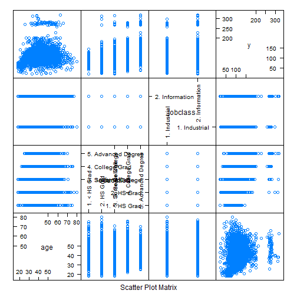
  
Another option is to use ggplot2 for color and regression smoothning.  

```r
## Color by jobclass
qplot(age, wage, data=training, color=jobclass)
```

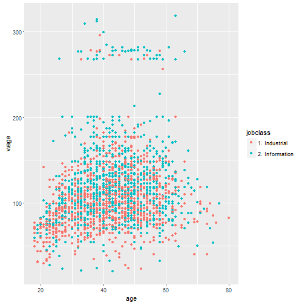

```r
## Color by education and add a regression smooth
qq <- qplot(age, wage, data=training, color=education)
qq + geom_smooth(method="lm", formula=y~x)
```

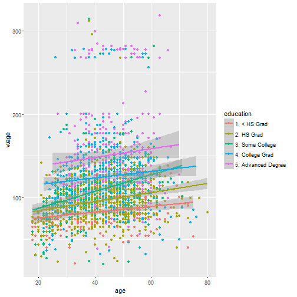

Another option is to create factors and then use jitter to make the boxplot.  

```r
library(Hmisc)
```

```
## Loading required package: survival
```

```
## 
## Attaching package: 'survival'
```

```
## The following object is masked from 'package:caret':
## 
##     cluster
```

```
## Loading required package: Formula
```

```
## 
## Attaching package: 'Hmisc'
```

```
## The following object is masked from 'package:randomForest':
## 
##     combine
```

```
## The following objects are masked from 'package:base':
## 
##     format.pval, round.POSIXt, trunc.POSIXt, units
```

```r
cutWage <- cut2(training$wage, g=3)
table(cutWage)
```

```
## cutWage
## [ 20.1, 91.7) [ 91.7,118.9) [118.9,318.3] 
##           703           721           678
```

```r
p2 <- qplot(cutWage, age, data=training, fill=cutWage, geom=c("boxplot", "jitter"))
p2
```

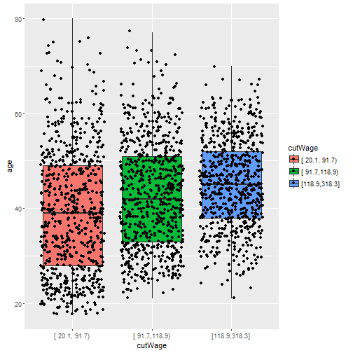

```r
t1 <- table(cutWage, training$jobclass)
t1
```

```
##                
## cutWage         1. Industrial 2. Information
##   [ 20.1, 91.7)           437            266
##   [ 91.7,118.9)           373            348
##   [118.9,318.3]           274            404
```

```r
prop.table(t1, 1)
```

```
##                
## cutWage         1. Industrial 2. Information
##   [ 20.1, 91.7)     0.6216216      0.3783784
##   [ 91.7,118.9)     0.5173370      0.4826630
##   [118.9,318.3]     0.4041298      0.5958702
```
  
And yet another option is to look at the density plots.  

```r
qplot(wage, color=education, data=training, geom="density")
```

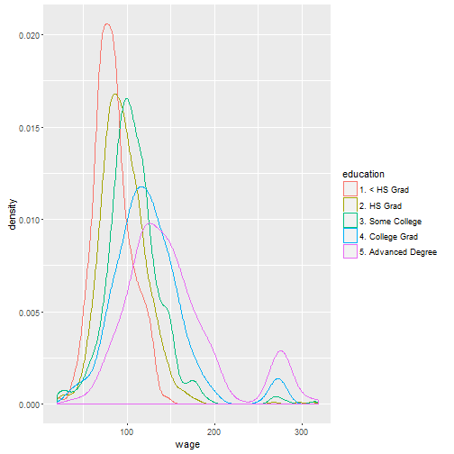

Some additional notes relevant to the prediction process include:  
  
1.  Only use the training data for plotting - no cheating with a peek at the test data!  
2.  Look for imbalances in outcomes/predictors, outliers, groups of "unexplained" points, skewed variables, etc.  
3.  Try to find the ggplot2 tutorial and the caret tutorial  
  
####_Pre-processing_  
Exploratory data analysis may reveal issues requiring data pre-processing.  This can be particularly the case with parametric approaches where skew, collinearity, missing neighbors (NA) and the like can cause problems.  
  
The spam dataset can again be analyzed for an example.  Note the extremely significant skew in the runs of capital letters (capitalAve).  
  

```r
library(caret); library(kernlab); data(spam)

inTrain <- createDataPartition(y=spam$type, p=0.75, list=FALSE)
training <- spam[inTrain, ]
testing <- spam[-inTrain, ]

hist(training$capitalAve, main="", xlab="Ave. capital run length")
```

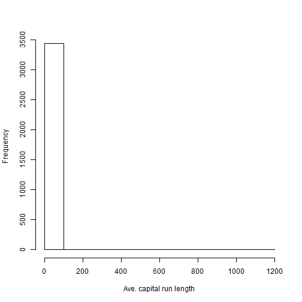

```r
mean(training$capitalAve) ; sd(training$capitalAve)
```

```
## [1] 5.288555
```

```
## [1] 32.53952
```

One option is to use base R to standardize each of the variables to N(0,1).  The mean and sd from the training set need to be applied to the test set data also, so that we stay uninformed as to the test set data. 


```r
## Calculate metrics from training set and apply to training set
trainCapAve <- training$capitalAve
trainCapAveS <- (trainCapAve - mean(trainCapAve)) / sd(trainCapAve)
mean(trainCapAveS) ; sd(trainCapAveS)
```

```
## [1] 9.100406e-18
```

```
## [1] 1
```

```r
## Apply the same transformations to the testing set
testCapAve <- testing$capitalAve
testCapAveS <- (testCapAve - mean(trainCapAve)) / sd(trainCapAve)
mean(testCapAveS) ; sd(testCapAveS)
```

```
## [1] -0.01193141
```

```
## [1] 0.8966113
```

Alternately, the preProcess() command can be used to automatically take the same commands and apply them to the training and testing data.  
  

```r
## Set up a preProcess() command
preObj <- preProcess(training[,-58], method=c("center", "scale")) ## standardizes all variables

## Apply to training
trainCapAveS <- predict(preObj, training[,-58])$capitalAve
mean(trainCapAveS); sd(trainCapAveS)
```

```
## [1] 9.268499e-18
```

```
## [1] 1
```

```r
## Apply to testing
testCapAveS <- predict(preObj, testing[,-58])$capitalAve
mean(testCapAveS); sd(testCapAveS)
```

```
## [1] -0.01193141
```

```
## [1] 0.8966113
```

The preProcess commands can also be passed to the train() commands.  
  

```r
set.seed(32343)
modelFit <- train(type ~ ., data=training, preProcess=c("center", "scale"), method="glm")
```

```
## Warning: glm.fit: fitted probabilities numerically 0 or 1 occurred

## Warning: glm.fit: fitted probabilities numerically 0 or 1 occurred

## Warning: glm.fit: fitted probabilities numerically 0 or 1 occurred
```

```
## Warning: glm.fit: algorithm did not converge
```

```
## Warning: glm.fit: fitted probabilities numerically 0 or 1 occurred

## Warning: glm.fit: fitted probabilities numerically 0 or 1 occurred

## Warning: glm.fit: fitted probabilities numerically 0 or 1 occurred

## Warning: glm.fit: fitted probabilities numerically 0 or 1 occurred

## Warning: glm.fit: fitted probabilities numerically 0 or 1 occurred

## Warning: glm.fit: fitted probabilities numerically 0 or 1 occurred

## Warning: glm.fit: fitted probabilities numerically 0 or 1 occurred

## Warning: glm.fit: fitted probabilities numerically 0 or 1 occurred

## Warning: glm.fit: fitted probabilities numerically 0 or 1 occurred

## Warning: glm.fit: fitted probabilities numerically 0 or 1 occurred
```

```
## Warning: glm.fit: algorithm did not converge
```

```
## Warning: glm.fit: fitted probabilities numerically 0 or 1 occurred

## Warning: glm.fit: fitted probabilities numerically 0 or 1 occurred

## Warning: glm.fit: fitted probabilities numerically 0 or 1 occurred

## Warning: glm.fit: fitted probabilities numerically 0 or 1 occurred

## Warning: glm.fit: fitted probabilities numerically 0 or 1 occurred

## Warning: glm.fit: fitted probabilities numerically 0 or 1 occurred

## Warning: glm.fit: fitted probabilities numerically 0 or 1 occurred

## Warning: glm.fit: fitted probabilities numerically 0 or 1 occurred

## Warning: glm.fit: fitted probabilities numerically 0 or 1 occurred

## Warning: glm.fit: fitted probabilities numerically 0 or 1 occurred

## Warning: glm.fit: fitted probabilities numerically 0 or 1 occurred

## Warning: glm.fit: fitted probabilities numerically 0 or 1 occurred

## Warning: glm.fit: fitted probabilities numerically 0 or 1 occurred
```

```r
print(modelFit)
```

```
## Generalized Linear Model 
## 
## 3451 samples
##   57 predictor
##    2 classes: 'nonspam', 'spam' 
## 
## Pre-processing: centered (57), scaled (57) 
## Resampling: Bootstrapped (25 reps) 
## Summary of sample sizes: 3451, 3451, 3451, 3451, 3451, 3451, ... 
## Resampling results
## 
##   Accuracy   Kappa      Accuracy SD  Kappa SD  
##   0.9179809  0.8278154  0.01824708   0.03536902
## 
## 
```

The Box-Cox transform is available, though since it is continuous, it does not solve the "many zeroes" problem, as shown by the decidedly non-linear QQ plot.  
  

```r
preObj <- preProcess(training[,-58], method=c("BoxCox")) ## standardizes all variables with Box-Cox
trainCapAveS <- predict(preObj, training[,-58])$capitalAve
par(mfrow=c(1,2)) ; hist(trainCapAveS) ; qqnorm(trainCapAveS) ; par(mfrow=c(1,1))
```

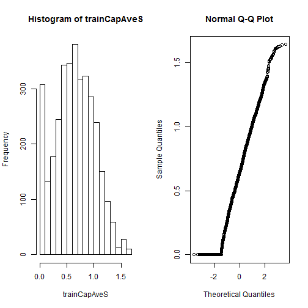

Since many prediction algorithms do not work well with NA, the k-nearest-neighbors approach can be applied to impute those:  
  

```r
## Create some fake NA data
set.seed(13343)
training$capAve <- training$capitalAve
selectNA <- rbinom(dim(training)[1], size=1, prob=0.05)==1
training$capAve[selectNA] <- NA

## Impute using knn
preObj <- preProcess(training[,-58], method="knnImpute")
capAve <- predict(preObj, training[,-58])$capAve
```

The preProcess() command is especially useful since it can be repeatedly applied to data as needed - train, test, validate, etc.  
  
####_Covariate creaion_  
Covariates (aka features or predictors) are the variables to be used in the model.  There are two levels:  
  
* Level 1 - from raw data to covariate (such as converting an e-mail to multiple descriptive statistics that could be used to predict whether it is spam)  
* Level 2 - transforming to create tidy covariates (such as squaring or taking a log or the like)  
  
Level 1 extractions tend to be domain specific, and the "science" (research) component is especially important during this phase.  Some guiding principles apply:  
  
* The balancing act is summarization vs. information loss  
* Examples include: 
  1.  Text Files: Frequency of words, frequency of phrases (google "ngrams"), proportion of capital letters, etc.  
  2.  Images: edges, corners, blobs, ridges ("computer vision feature detection")  
  3.  Webpages: Number/type of elements, colors, videos ("A/B testing")  
  4.  People: Height, weight, hair color, sex, country of origin  
* The more you know about the domain, the better job you will do  
* When in doubt, err on the side of more features  
* This phase can be automated, but be very careful!  There is high risk of over-fitting, finding features that work great on the training data and not at all on the testing data  
  
Level 2 conversions make tidy covariates (Level 1) in to transformed covariates (Level 2):  
  
* This is more often for some methods (regression, svm) than others (trees, forests)  
* Should only be run on the training data  
* Exploratory data analysis (plotting, tables, etc.) is the core component  
* New covariates should be added to data frames, and with recognizable names  
  
The wage data (ISLR) will again be used for an example:  

```r
library(ISLR) ; library(caret) ; data(Wage)
inTrain <- createDataPartition(y=Wage$wage, p=0.7, list=FALSE)
training <- Wage[inTrain, ]
testing <- Wage[-inTrain, ]
```
  
One common approach is to create indicator (dummy) variables:  

```r
table(training$jobclass)
```

```
## 
##  1. Industrial 2. Information 
##           1051           1051
```

```r
dummies <- dummyVars(wage ~ jobclass, data=training) ## dummyVars is a caret function
head(predict(dummies, newdata=training)) ## using predict() on dummies creates the dummy variables
```

```
##        jobclass.1. Industrial jobclass.2. Information
## 86582                       0                       1
## 161300                      1                       0
## 155159                      0                       1
## 11443                       0                       1
## 376662                      0                       1
## 450601                      1                       0
```
  
There is a function for identifying variables with near zero variance.  This is handy, as these will have no predictive power:  

```r
nsv <- nearZeroVar(training, saveMetrics=TRUE)
nsv
```

```
##            freqRatio percentUnique zeroVar   nzv
## year        1.037356    0.33301618   FALSE FALSE
## age         1.027027    2.85442436   FALSE FALSE
## sex         0.000000    0.04757374    TRUE  TRUE
## maritl      3.272931    0.23786870   FALSE FALSE
## race        8.938776    0.19029496   FALSE FALSE
## education   1.389002    0.23786870   FALSE FALSE
## region      0.000000    0.04757374    TRUE  TRUE
## jobclass    1.000000    0.09514748   FALSE FALSE
## health      2.468647    0.09514748   FALSE FALSE
## health_ins  2.352472    0.09514748   FALSE FALSE
## logwage     1.061728   19.17221694   FALSE FALSE
## wage        1.061728   19.17221694   FALSE FALSE
```
  
Additionally, splines can be created on the training data and then applied to the test data:  

```r
library(splines)
bsBasis <- bs(training$age, df=3) ## Creates a polynomial variable
head(bsBasis) ## column 1 is age, column 2 is age^2, column 3 is age^3
```

```
##              1          2           3
## [1,] 0.2368501 0.02537679 0.000906314
## [2,] 0.4163380 0.32117502 0.082587862
## [3,] 0.4308138 0.29109043 0.065560908
## [4,] 0.3625256 0.38669397 0.137491189
## [5,] 0.3063341 0.42415495 0.195763821
## [6,] 0.4241549 0.30633413 0.073747105
```

```r
## Plot the results from the cubic spline
lm1 <- lm(wage ~ bsBasis, data=training)
plot(training$age, training$wage, pch=19, cex=0.75)
points(training$age, predict(lm1, newdata=training), col="red", cex=1.5, pch=19)
```

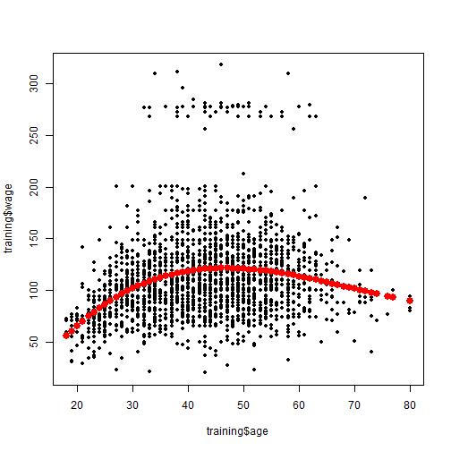

```r
## Application of the spline to the test data
head(predict(bsBasis, age=testing$age)) ## need to use the exact same procedure
```

```
##              1          2           3
## [1,] 0.2368501 0.02537679 0.000906314
## [2,] 0.4163380 0.32117502 0.082587862
## [3,] 0.4308138 0.29109043 0.065560908
## [4,] 0.3625256 0.38669397 0.137491189
## [5,] 0.3063341 0.42415495 0.195763821
## [6,] 0.4241549 0.30633413 0.073747105
```

There is a guide on preprcessing with caret that may be valuable to look at.  Good science and domain knowledge are the keys - google "feature extraction for [good search term]" before starting in a new area.  And, leverage good exploratory analysis techniques (training set only) and then the preProcess() function in caret.  Be very careful not to overfit, and maintain a clean "test" data set to understand out of model error.  
  
####_Pre-processing with principal component analysis (PCA)_  
Principal Component Analysis (PCA) is a topic that I want to explore further.  This module provided a few basic pointers about the concept and its usage in R.  
  
The basic idea is that many of the predictor variables may be highly correlated.  It may be nice to include a summary subset that retains most of the information but little of the correlation.  Broadly, there are two goals:  
  
1.  Statistics - find a new set of variables that are uncorrelated but explain as much variance as possible  
2.  Compression - find the lowest-rank (fewest variables) matrix that explains the original data  
  
The "spam" dataset can again be analyzed to explore the concept:  

```r
library(caret); library(kernlab); data(spam)

inTrain <- createDataPartition(y=spam$type, p=0.75, list=FALSE)
training <- spam[inTrain, ]
testing <- spam[-inTrain, ]

## Column 58 is the factor we want to predict; find all the other correlations
## Set the diagonals (variables with self, which will have r=1) all to 0
## Flag everything else with an 80%+ magnitude of correlation
M <- abs(cor(training[ , -58]))
diag(M) <- 0 ## takes care of the correlation with self issue
which(M > 0.8, arr.ind=TRUE)
```

```
##        row col
## num415  34  32
## direct  40  32
## num857  32  34
## direct  40  34
## num857  32  40
## num415  34  40
```

```r
## Identify the culprits, and plot them
names(spam)[c(32, 34, 40)]
```

```
## [1] "num857" "num415" "direct"
```

```r
plot(spam[,34], spam[, 32])
```

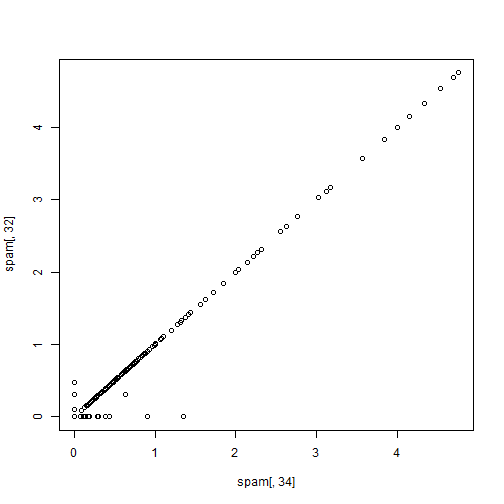

```r
plot(spam[,40], spam[, 32])
```

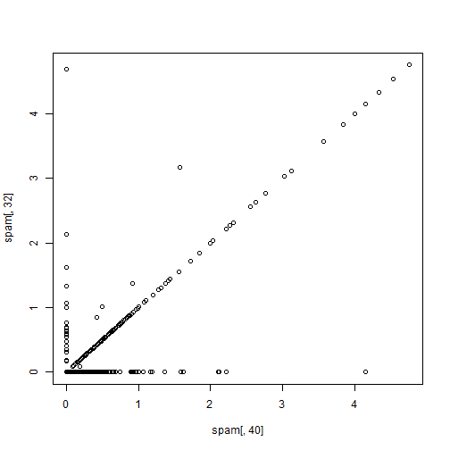
  
The basic idea behind PCA is that we might not need (or even want) every predictor:  
  
1.  Weighted combinations of predictors may work better  
2.  Combinations should be chosen to retain as much information (explain as much variance) as possible  
3.  Benefits include both a smaller dataset (fewer predictors) and reduced noise (benefit of averaging)  
  
One potential idea is to "rotate"" the data - see below for an example:  

```r
## Recall that 0.71 is sqrt(2), so this essentially "preserves"" the length
X <- 0.71 * training$num415 + 0.71 * training$num857 ## captures almost all of the information
Y <- 0.71 * training$num415 - 0.71 * training$num857 ## captures almost none of the information
plot(X, Y)
```

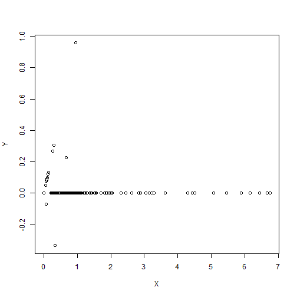
  
The scaled solutions are SVD and PCA:  
  
* SVD - Suppose that X is a matrix with each variable in a column and each observation in a row, then SVD is a matrix decomposition such that X = U % * % D % * % t(V), where the columns of U are orthogonal (left singular vectors), the columns of V are orthogonal (right singular vectors), and D is diagnonal (singular values)  
* PCA - The principal components are equal to the right singular vectors (columns of V) if you first standardize (subtract mu, then divide by sigma) all of the variables  
  
A small example can again be drawn from the spam dataset:  

```r
## Create a small dataset and then use it
smallSpam <- spam[,c(34,32)]
prComp <- prcomp(smallSpam)
plot(prComp$x[,1], prComp$x[,2]) ## pretty much like what we saw with the 0.71 (sqrt(2)) transform above
```

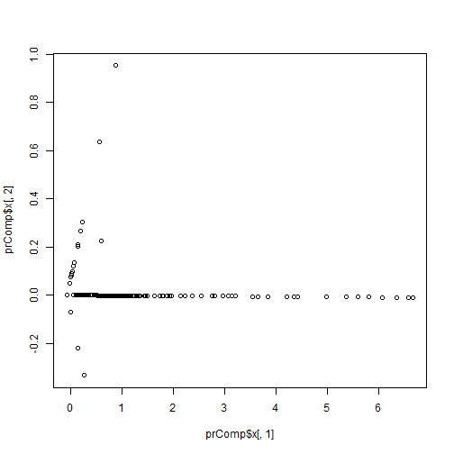

```r
## See which rotations have been performed
## PC1 explains the most variation, PC2 explains the second most variation, etc.
prComp$rotation
```

```
##              PC1        PC2
## num415 0.7080625  0.7061498
## num857 0.7061498 -0.7080625
```
  
The example can be extended to the full spam dataset, seeing how well the PC correlate to the outcome:  

```r
typeColor <- ((spam$type=="spam")*1 + 1)
prComp <- prcomp(log10(spam[,-58]+1)) ## often needed in PCA to deal with extreme skew in the data
plot(prComp$x[,1], prComp$x[,2], col=typeColor, xlab="PC1", ylab="PC2")
```

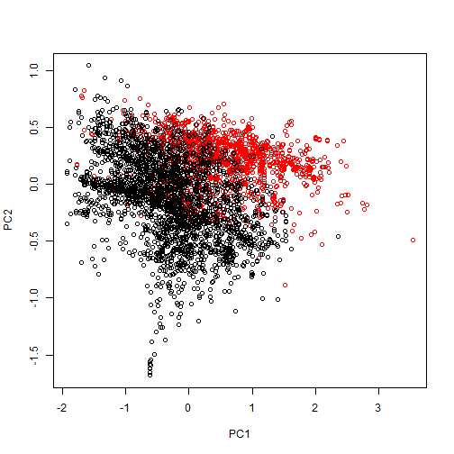
  
PCA can also be run inside the caret function, making use of preProcess:  

```r
## pcaComp is the number of components to create
## log10 is used to solve for the problem of extreme skew in the underlying data
preProc <- preProcess(log10(spam[,-58]+1), method="pca", pcaComp=2)
spamPC <- predict(preProc, log10(spam[,-58]+1))
plot(spamPC[,1], spamPC[,2], col=typeColor)
```

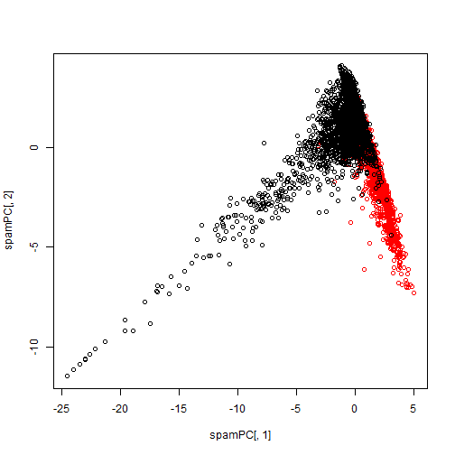

Lastly, the full process can be used to train the model and then test it.  Note that preProcess ensures that we use the same parameters on the test data.  It is over-fitting if we update PCA to use new transformations based on what could be observed in the test data.  We should be going in to this blind.  
  

```r
## Create PCA from the training data, use methodology on training data, fit GLM
preProc <- preProcess(log10(training[,-58]+1), method="pca", pcaComp=2)
trainPC <- predict(preProc, log10(training[,-58]+1))
modelFit <- train(training$type ~ ., method="glm", data=trainPC)
```

```
## Warning: glm.fit: fitted probabilities numerically 0 or 1 occurred

## Warning: glm.fit: fitted probabilities numerically 0 or 1 occurred

## Warning: glm.fit: fitted probabilities numerically 0 or 1 occurred

## Warning: glm.fit: fitted probabilities numerically 0 or 1 occurred

## Warning: glm.fit: fitted probabilities numerically 0 or 1 occurred

## Warning: glm.fit: fitted probabilities numerically 0 or 1 occurred

## Warning: glm.fit: fitted probabilities numerically 0 or 1 occurred

## Warning: glm.fit: fitted probabilities numerically 0 or 1 occurred

## Warning: glm.fit: fitted probabilities numerically 0 or 1 occurred

## Warning: glm.fit: fitted probabilities numerically 0 or 1 occurred

## Warning: glm.fit: fitted probabilities numerically 0 or 1 occurred

## Warning: glm.fit: fitted probabilities numerically 0 or 1 occurred

## Warning: glm.fit: fitted probabilities numerically 0 or 1 occurred

## Warning: glm.fit: fitted probabilities numerically 0 or 1 occurred

## Warning: glm.fit: fitted probabilities numerically 0 or 1 occurred

## Warning: glm.fit: fitted probabilities numerically 0 or 1 occurred

## Warning: glm.fit: fitted probabilities numerically 0 or 1 occurred

## Warning: glm.fit: fitted probabilities numerically 0 or 1 occurred

## Warning: glm.fit: fitted probabilities numerically 0 or 1 occurred

## Warning: glm.fit: fitted probabilities numerically 0 or 1 occurred

## Warning: glm.fit: fitted probabilities numerically 0 or 1 occurred

## Warning: glm.fit: fitted probabilities numerically 0 or 1 occurred

## Warning: glm.fit: fitted probabilities numerically 0 or 1 occurred

## Warning: glm.fit: fitted probabilities numerically 0 or 1 occurred

## Warning: glm.fit: fitted probabilities numerically 0 or 1 occurred

## Warning: glm.fit: fitted probabilities numerically 0 or 1 occurred
```

```r
## Use identical methodology on testing data, and review the accuracy
testPC <- predict(preProc, log10(testing[,-58]+1))
confusionMatrix(predict(modelFit, testPC), testing$type)
```

```
## Confusion Matrix and Statistics
## 
##           Reference
## Prediction nonspam spam
##    nonspam     645   73
##    spam         52  380
##                                           
##                Accuracy : 0.8913          
##                  95% CI : (0.8719, 0.9087)
##     No Information Rate : 0.6061          
##     P-Value [Acc > NIR] : < 2e-16         
##                                           
##                   Kappa : 0.7705          
##  Mcnemar's Test P-Value : 0.07364         
##                                           
##             Sensitivity : 0.9254          
##             Specificity : 0.8389          
##          Pos Pred Value : 0.8983          
##          Neg Pred Value : 0.8796          
##              Prevalence : 0.6061          
##          Detection Rate : 0.5609          
##    Detection Prevalence : 0.6243          
##       Balanced Accuracy : 0.8821          
##                                           
##        'Positive' Class : nonspam         
## 
```
  
This process alone, using just two principal components, is ~89% accurate in classifying e-mail as spam.  This significantly improves on the no-information rate of ~61%.  
  
Lastly, the PCA approach can be passed directly to the train() function, which will create the same number of PCA as predictors in the initial data.  This drives accuracy up slightly more to ~92%:  

```r
modelFit <- train(training$type ~ ., method="glm", preProcess="pca", data=training)
```

```
## Warning: glm.fit: fitted probabilities numerically 0 or 1 occurred

## Warning: glm.fit: fitted probabilities numerically 0 or 1 occurred

## Warning: glm.fit: fitted probabilities numerically 0 or 1 occurred

## Warning: glm.fit: fitted probabilities numerically 0 or 1 occurred

## Warning: glm.fit: fitted probabilities numerically 0 or 1 occurred

## Warning: glm.fit: fitted probabilities numerically 0 or 1 occurred

## Warning: glm.fit: fitted probabilities numerically 0 or 1 occurred

## Warning: glm.fit: fitted probabilities numerically 0 or 1 occurred

## Warning: glm.fit: fitted probabilities numerically 0 or 1 occurred

## Warning: glm.fit: fitted probabilities numerically 0 or 1 occurred

## Warning: glm.fit: fitted probabilities numerically 0 or 1 occurred

## Warning: glm.fit: fitted probabilities numerically 0 or 1 occurred

## Warning: glm.fit: fitted probabilities numerically 0 or 1 occurred

## Warning: glm.fit: fitted probabilities numerically 0 or 1 occurred

## Warning: glm.fit: fitted probabilities numerically 0 or 1 occurred

## Warning: glm.fit: fitted probabilities numerically 0 or 1 occurred

## Warning: glm.fit: fitted probabilities numerically 0 or 1 occurred

## Warning: glm.fit: fitted probabilities numerically 0 or 1 occurred

## Warning: glm.fit: fitted probabilities numerically 0 or 1 occurred

## Warning: glm.fit: fitted probabilities numerically 0 or 1 occurred

## Warning: glm.fit: fitted probabilities numerically 0 or 1 occurred

## Warning: glm.fit: fitted probabilities numerically 0 or 1 occurred

## Warning: glm.fit: fitted probabilities numerically 0 or 1 occurred

## Warning: glm.fit: fitted probabilities numerically 0 or 1 occurred

## Warning: glm.fit: fitted probabilities numerically 0 or 1 occurred

## Warning: glm.fit: fitted probabilities numerically 0 or 1 occurred
```

```r
confusionMatrix(predict(modelFit, testing), testing$type)
```

```
## Confusion Matrix and Statistics
## 
##           Reference
## Prediction nonspam spam
##    nonspam     658   50
##    spam         39  403
##                                           
##                Accuracy : 0.9226          
##                  95% CI : (0.9056, 0.9374)
##     No Information Rate : 0.6061          
##     P-Value [Acc > NIR] : <2e-16          
##                                           
##                   Kappa : 0.8372          
##  Mcnemar's Test P-Value : 0.2891          
##                                           
##             Sensitivity : 0.9440          
##             Specificity : 0.8896          
##          Pos Pred Value : 0.9294          
##          Neg Pred Value : 0.9118          
##              Prevalence : 0.6061          
##          Detection Rate : 0.5722          
##    Detection Prevalence : 0.6157          
##       Balanced Accuracy : 0.9168          
##                                           
##        'Positive' Class : nonspam         
## 
```
  
A few final thoughts on PCA include:  
  
* It tends to be most useful for linear models such as LDA (linear discriminant)  
* It will likely make it harder to interpret the predictors  
* Watch out for outliers, which are especially bad for PCA!  Plot to identify, transform (log, Box-Cox, etc.) as needed prior to PCA  
* Additional details are in "Exploratory Data Analysis" (JHU Coursera) and "Elements of Statistical Learning"  
  
####_Predicting with regression_  
The caret library works well with regression, layering on top some of the machine-learning components (ease of test/train, predictions, etc.).  The advantage of regression is its simplicity (implement and interpret) and accuracy in linear settings.  The disadvantage of regression is that it typically shows poor performance in decidedly non-linear setting.  
  
The Old Faithful eruptions data (datasets "faithful") serves as a background for this example:  

```r
library(caret); data(faithful); set.seed(333)
inTrain <- createDataPartition(y=faithful$waiting, p=0.5, list=FALSE)
trainFaith <- faithful[inTrain, ]; testFaith <- faithful[-inTrain, ]
head(trainFaith)
```

```
##   eruptions waiting
## 1     3.600      79
## 3     3.333      74
## 5     4.533      85
## 6     2.883      55
## 7     4.700      88
## 8     3.600      85
```

```r
## Data are largely linear - fit an LM accordingly
plot(trainFaith$waiting, trainFaith$eruptions, pch=19, col="blue", xlab="Waiting", ylab="Duration")
lm1 <- lm(eruptions ~ waiting, data=trainFaith)
summary(lm1)
```

```
## 
## Call:
## lm(formula = eruptions ~ waiting, data = trainFaith)
## 
## Residuals:
##      Min       1Q   Median       3Q      Max 
## -1.26990 -0.34789  0.03979  0.36589  1.05020 
## 
## Coefficients:
##              Estimate Std. Error t value Pr(>|t|)    
## (Intercept) -1.792739   0.227869  -7.867 1.04e-12 ***
## waiting      0.073901   0.003148  23.474  < 2e-16 ***
## ---
## Signif. codes:  0 '***' 0.001 '**' 0.01 '*' 0.05 '.' 0.1 ' ' 1
## 
## Residual standard error: 0.495 on 135 degrees of freedom
## Multiple R-squared:  0.8032,	Adjusted R-squared:  0.8018 
## F-statistic:   551 on 1 and 135 DF,  p-value: < 2.2e-16
```

```r
lines(trainFaith$waiting, lm1$fitted, lwd=3)
```

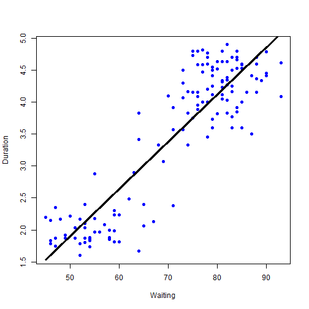

Given the linearity of the relationship, the typical lm() approach from previous modules would likely work fine.  See for example:  

```r
## Predict forward on to some new data
## Base R/Stats commands
coef(lm1)[[1]] + coef(lm1)[[2]]*80
```

```
## [1] 4.119307
```

```r
## Predict function
newdata <- data.frame(waiting=80)
predict(lm1, newdata)
```

```
##        1 
## 4.119307
```
  
The error rates can be compared on the test and training data.  The test data gives a more realistic estimate for the "outof sample" (true) error, since it is not at all influenced (at least not favorably!) by any overfitting to noise in the training data.  

```r
par(mfrow=c(1,2))

## Apply to training data
plot(trainFaith$waiting, trainFaith$eruptions, pch=19, col="blue", xlab="Waiting", ylab="Duration")
lines(trainFaith$waiting, predict(lm1), lwd=3)

## Apply to testing data
plot(testFaith$waiting, testFaith$eruptions, pch=19, col="blue", xlab="Waiting", ylab="Duration")
lines(testFaith$waiting, predict(lm1, newdata=testFaith), lwd=3)
```

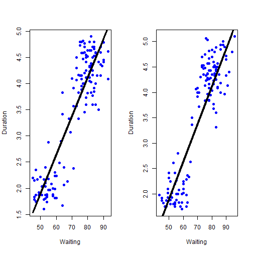

```r
## Compare RMSE
sqrt(mean((lm1$fitted - trainFaith$eruptions)^2))
```

```
## [1] 0.4914146
```

```r
sqrt(mean((predict(lm1, newdata=testFaith) - testFaith$eruptions)^2))
```

```
## [1] 0.5025031
```

```r
par(mfrow=c(1,1))

## Plot the prediction intervals as well
pred1 <- predict(lm1, newdata=testFaith, interval="prediction")
ord <- order(testFaith$waiting)
plot(testFaith$waiting, testFaith$eruptions, pch=19, col="blue")
matlines(testFaith$waiting[ord], pred1[ord, ], type="l", col=c(1,2,2), lty=c(1,1,1), lwd=3)
```

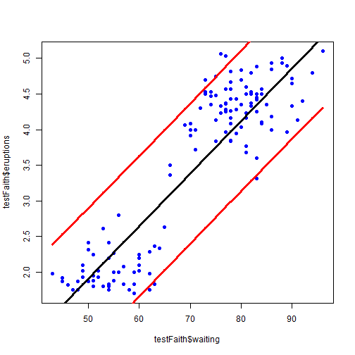
  
The identical model can be achieved using the train() function in the caret library:  

```r
modFit <- train(eruptions ~ waiting, data=trainFaith, method="lm")
summary(modFit$finalModel)
```

```
## 
## Call:
## lm(formula = .outcome ~ ., data = dat)
## 
## Residuals:
##      Min       1Q   Median       3Q      Max 
## -1.26990 -0.34789  0.03979  0.36589  1.05020 
## 
## Coefficients:
##              Estimate Std. Error t value Pr(>|t|)    
## (Intercept) -1.792739   0.227869  -7.867 1.04e-12 ***
## waiting      0.073901   0.003148  23.474  < 2e-16 ***
## ---
## Signif. codes:  0 '***' 0.001 '**' 0.01 '*' 0.05 '.' 0.1 ' ' 1
## 
## Residual standard error: 0.495 on 135 degrees of freedom
## Multiple R-squared:  0.8032,	Adjusted R-squared:  0.8018 
## F-statistic:   551 on 1 and 135 DF,  p-value: < 2.2e-16
```

In summary, the caret library can be a useful aid to linear regression.  Sometimes, the many advantages of regression make this an optimal predictive approach.  Other times, the much higher predictive power of other approaches (especially when data are non-linear) pushes regression in to the background.  
  
####_Predicting with regression (multiple covariates)_  
